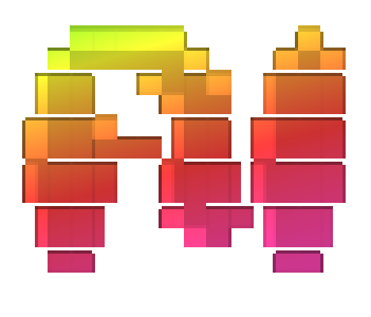

<br>
<p align="center">
  
</p>

<p align="center">
  <a href="https://github.com/nurf-ai/ai/actions/workflows/ci.yml"></a>
  <a href="https://pkg.go.dev/github.com/nurf-ai/ai"></a>
</p>

<p align="center">Multimodal Go module for building across AI providers, with realistic cost tracking baked in, not just token counts.</p>

<p align="center"><sub>From the obvious to the overlooked: chat, reasoning, tool use, structured output, image gen & editing, video gen, speech-to-text, embeddings, moderation.</sub></p>

## Install

```bash
go get github.com/nurf-ai/ai
```

## Usage

### Chat

```go
import "github.com/nurf-ai/ai"

llm := ai.NewLLMProvider(provider, apiKey, model)

resp, err := llm.Chat(ctx, []ai.Message{
    {Role: "user", Content: "Hello"},
}, nil)
```

### Streaming

Falls back to `Chat` transparently.

Iterator (Go 1.23+):

```go
llm := ai.NewLLMProvider(provider, apiKey, model)

chunks, result := ai.Stream(ctx, llm, messages, nil)

for chunk, err := range chunks {
    fmt.Print(chunk.Text)
}
resp, err := result.Response()
```

Channel (for select/fan-out):

```go
ch, wait := ai.StreamWithChan(ctx, llm, messages, nil)

for chunk := range ch {
    fmt.Print(chunk.Text)
}
resp, err := wait()
```

### Vision + structured output

Hand a multimodal turn (text + base64 images) to any provider and get schema-constrained JSON back. Providers that cannot see images return `ai.ErrVisionUnsupported` instead of silently dropping them; `ai.WithMaxTokens` raises the output budget (default 4096).

```go
parts := []ai.Part{
    ai.ImagePart{MediaType: "image/jpeg", Data: b64},
    ai.TextPart{Text: "Describe every part of this object."},
}
ctx = ai.WithMaxTokens(ctx, 16000)
out, err := ai.StructuredOutputFromParts(ctx, llm, parts, sysPrompt, schemaJSON) // map[string]any
```

### Embeddings

```go
embedder := ai.NewEmbedder(provider, apiKey)
vectors, err := embedder.EmbedText(ctx, []string{"hello world"})
```

### Image Generation

```go
img, err := ai.NewImageProvider(ctx, provider, apiKey, model)
b64, err := img.Generate(ctx, "a cat in space", "", "")
```

### Video Generation

```go
// fal (LTX-2.3)
video, err := ai.NewVideoProvider("fal", apiKey, "")
res, err := video.Generate(ctx, ai.VideoRequest{
    Prompt:   "a robot adopts a stray cat",
    Image:    lastFrameJPEG, // optional first-frame conditioning
    Duration: 6, Resolution: "1080p", AspectRatio: "16:9",
})

// gemini (Omni Flash)
video, err := ai.NewVideoProvider("gemini", apiKey, "")
res, err := video.Generate(ctx, ai.VideoRequest{
    Prompt: "a robot adopts a stray cat",
    Resolution: "720p", AspectRatio: "16:9",
})

// veo (Veo 3.1 Fast — async, same key as gemini)
video, err := ai.NewVideoProvider("veo", apiKey, "")
res, err := video.Generate(ctx, ai.VideoRequest{
    Prompt: "a robot adopts a stray cat",
    Duration: 8, Resolution: "1080p",
})

// minimax (H3 direct API — async)
video, err := ai.NewVideoProvider("minimax", apiKey, "")
res, err := video.Generate(ctx, ai.VideoRequest{
    Prompt: "a robot adopts a stray cat",
    Duration: 5, Resolution: "768P",
})

// router — picks cheapest available provider per request
fal, _ := ai.NewVideoProvider("fal", falKey, "")
gemini, _ := ai.NewVideoProvider("gemini", geminiKey, "")
veo, _ := ai.NewVideoProvider("veo", geminiKey, "")
minimax, _ := ai.NewVideoProvider("minimax", minimaxKey, "")
router, _ := ai.NewVideoRouter(
    ai.WithRoute(fal),
    ai.WithRoute(gemini),
    ai.WithRoute(veo),
    ai.WithRoute(minimax),
    ai.RouteByPrice(0.7),
    ai.RouteByAvailability(0.3),
)
res, err := router.Generate(ctx, ai.VideoRequest{
    Prompt: "a robot adopts a stray cat",
    Resolution: "720p",
})
// res.Model tells you which provider was chosen
```

### Speech-to-Text

```go
stt := ai.NewSTTProvider(provider, apiKey, model)
text, err := stt.Transcribe(ctx, audioReader, "audio.mp3")
```

### Metering & Pricing

```go
ai.SetLLMMeter(llm, func(ev ai.UsageEvent) {
    log.Printf("%s: %d tokens, $%.6f", ev.Model, ev.TotalTokens, ev.EstimatedCostUSD)
})
```

Attribute calls via context — `ai.WithMeterCallerID`, `ai.WithMeterOperation`, `ai.WithMeterMetadata(ctx, map[string]any{...})` — every provider merges stamped metadata into `UsageEvent.Metadata` (provider-set keys win).

Built-in per-model cost estimation via `EstimateCostFull` (tokens / flat per image), `EstimateVideoCost` (per second of video), and `EstimateVideoCostByTokens` / `EstimateImageCostByTokens` (actual token counts from provider response). Rates and context windows for all supported models are maintained in [`models.json`](models.json) — the single source of truth, embedded at compile time.

## Providers

| Factory | Providers | Features |
|---------|-----------|----------|
| `NewLLMProvider(provider, apiKey, model)` | anthropic, openai, gemini, ollama, huggingface | Chat, streaming, structured output, tools |
| `NewImageProvider(ctx, provider, apiKey, model)` | openai, gemini | Image generation / editing |
| `NewSTTProvider(provider, apiKey, model)` | openai | Speech-to-text |
| `NewVideoProvider(provider, apiKey, model)` | fal, gemini, veo, minimax | Video generation (text/image-to-video) |
| `NewEmbedder(provider, apiKey)` | openai | Text embeddings |

Each ✓ means the integration test passes:

<!-- testmatrix:start -->

| Provider | Model | Chat | Stream | Reasoning | Structured Output | From Schema | Tools | Embeddings | STT | Moderation | Image Gen | Img Edit | Img Edit Ref | Txt2Vid | Img2Vid | Caching |
|----------|-------|:---:|:---:|:---:|:---:|:---:|:---:|:---:|:---:|:---:|:---:|:---:|:---:|:---:|:---:|:---:|
| Anthropic | `claude-haiku-4-5` | ✓ | ✓ | ✓ | ✓ | ✓ | ✓ | | | | | | | | | ✓ |
| OpenAI | `gpt-4o-mini` | ✓ | ✓ | | ✓ | ✓ | ✓ | | | | | | | | | |
| OpenAI | `gpt-5-mini` | | | ✓ | | | | | | | | | | | | |
| OpenAI | `text-embedding-3-small` | | | | | | | ✓ | | | | | | | | |
| OpenAI | `whisper-1` | | | | | | | | ✓ | | | | | | | |
| OpenAI | `omni-moderation-latest` | | | | | | | | | ✓ | | | | | | |
| OpenAI | `gpt-image-1` | | | | | | | | | | ✓ | ✓ | | | | |
| Gemini | `gemini-3.6-flash` | ✓ | ✓ | | ✓ | ✓ | ✓ | | | | | | | | | |
| Gemini | `gemini-2.5-flash-image` | | | | | | | | | | ✓ | ✓ | ✓ | | | |
| Gemini | `gemini-omni-1.1-flash` | | | | | | | | | | | | | ✓ | ✓ | |
| Gemini | `veo-3.1-fast` | | | | | | | | | | | | | ✓ | | |
| Hugging Face | `Kimi-K2-Instruct` | ✓ | ✓ | | ✓ | ✓ | ✓ | | | | | | | | | |
| Hugging Face | `Kimi-K3` | ✓ | ✓ | | ✓ | ✓ | ✓ | | | | | | | | | |
| Ollama | `qwen3.5:0.8b` | ✓ | ✓ | | | | | | | | | | | | | |
| Ollama | `gpt-oss:20b` | ✓ | ✓ | | ✓ | | | | | | | | | | | |
| Ollama | `gemma4:e4b` | ✓ | ✓ | | | | | | | | | | | | | |
| fal | `ltx-2.3/t2v/fast` | | | | | | | | | | | | | ✓ | | |
| fal | `ltx-2.3/i2v/fast` | | | | | | | | | | | | | | ✓ | |
| fal | `minimax/h3-max/i2v` | | | | | | | | | | | | | | ✓ | |
| MiniMax | `MiniMax-H3` | | | | | | | | | | | | | ✓ | ✗ | |

<!-- testmatrix:end -->

## Contributing

### Setup

```bash
git clone https://github.com/nurf-ai/ai.git
cd ai
go test ./...
```

### Adding a provider

1. Create `<provider>.go` implementing `LLMProvider`
2. Add model entries to [`models.json`](models.json) (pricing + `max_input_tokens`)
3. Register in `provider.go` (`NewLLMProvider` switch)
4. Add a smoke test to `integration_test.go`
5. Run both test suites before submitting

### Adding a model

1. Add entry to [`models.json`](models.json) under the provider key — include `max_input_tokens`
2. `go test ./...` — `TestPricingCoverage` will fail if `max_input_tokens` is missing

### Updating models

Edit [`models.json`](models.json) directly — it's embedded at build time via `go:embed`. No Go code changes needed.

### Testing

Unit tests (no API keys needed, runs in CI):

```bash
go test ./...
```

Integration tests (real API calls, run locally):

```bash
cp .env.test.tpl .env.test   # fill in your API keys
go test -tags=integration -count=1 -json ./... | go run ./cmd/testmatrix
```

`.env.test` is loaded automatically via `godotenv` in `TestMain`. Only set the keys you have — providers with missing keys are skipped (`∅`).

`testmatrix` prints live progress with per-test token counts and cost, failure details, and per-provider cost totals to stderr:

```
  ✓ Anthropic/claude-haiku-4-5/Chat (1.8s)                     800 tok_in, 80 tok_out, $0.0003
  ✓ OpenAI/gpt-4o-mini/Chat (1.2s)                             500 tok_in, 50 tok_out, $0.0001
  ✓ OpenAI/gpt-4o-mini/Moderation (0.3s)
  ∅ Ollama

4 passed, 0 failed, 1 skipped

── cost ──
  Anthropic      $0.0003  (800 tok_in, 80 tok_out, 200 tok_cached)
  OpenAI         $0.0001  (500 tok_in, 50 tok_out)
  TOTAL          $0.0004  (1300 tok_in, 130 tok_out, 200 tok_cached)
```

> [!NOTE]
> The capability/coverage matrix goes to stdout — paste it into the README between the `<!-- testmatrix:start/end -->` markers. PRs that add or change provider capabilities must include an updated matrix.

All provider tests use `t.Parallel()`, so subtests run concurrently within a single `go test` invocation. To split across CI jobs, use `-run`:

```bash
go test -tags=integration -v -run TestAnthropic ./...
go test -tags=integration -v -run TestOpenAI ./...
go test -tags=integration -v -run TestGemini ./...
go test -tags=integration -v -run TestHuggingFace ./...
go test -tags=integration -v -run TestOllama ./...
```

See `.env.test.tpl` for the full list of env vars.

### Guidelines

- CI runs `go vet`, `golangci-lint`, and `go test -race` — make sure they pass locally before submitting:

```bash
go vet ./...
gofmt -l .
golangci-lint run
go test -race ./...
```

- Releases are automated via [Release Please](https://github.com/googleapis/release-please) — use [conventional commits](https://www.conventionalcommits.org/) and a release PR is created automatically on push to main. The prefix determines the version bump:

  | Prefix | Bump | When to use |
  |--------|------|-------------|
  | `feat:` | minor | New capability in the library |
  | `fix:` | patch | Bug fix in library code |
  | `docs:`, `chore:`, `test:`, `ci:` | none | No release — README, tooling, tests, CI |
